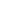

# Eyecons

A 16x16 (scallable vector graphics) icon pack that prioritizes consistency and quality over quantity.
All icons are optimized for the web, they use `currentColor` (`color` property in CSS) instead of black/white allowing for adaptability.

If there are missing icons that you would like to use, feel free to open an [issue](https://github.com/bbfh-dev/eyecons/issues/new) proposing it. Creation of icons is a tedious process that can take a lot of time, so please be patient.

<!-- vim-markdown-toc GFM -->

- [🖥️ Preview](#-preview)
- [📦 Usage](#-usage)

<!-- vim-markdown-toc -->

# 🖥️ Preview

This preview is generated by a script, therefore always up-to-date:

<!-- insert-icons-preview -->

# 📦 Usage

You can use it by downloading the [Latest release](https://github.com/bbfh-dev/eyecons/releases/latest) that contains all of the icons in `.svg` format.

The package is simply the contents of `icons/` directory, meaning you can use/download individual icons from this repo.
